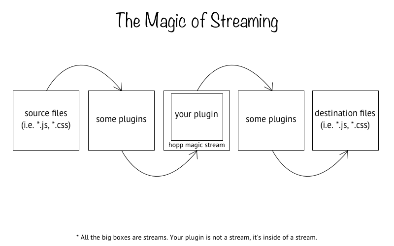

# Basics

hopp is a build tool, we know that by now. It works a bit differently
than other build tools and it is some of these differences that affect
the architecture and development of hopp plugins.

As a plugin maker, **your purpose is to write some code that can transform
some other code**. This transformation process can be whatever you want.
In the case of static analysis tools, it could be something like linting
code to check for bugs. This would be the conversion of some code that
needs to be linted into console output that describes the issues. If you
build a plugin for a preprocessor (such as less or sass), your job is to
compile the code from its source to a usable output (such as css).

Regardless of how you do it, your primary job is to transform. hopp
tries to make this job as easy as possible by stripping away much of
the complication. **Plugins expose asynchronous functions (or a
synchronous function that returns a Promise).** In the background, hopp
wraps your function inside of a transformation stream to take advantage
of node's streaming capabilities when handling files. What this means
for you is that your plugin code will be part of a larger stream which
is transforming code. The **input to your plugin will be the data entering
the stream** and consequently the **output of your plugin will be the data
leaving the stream**.

Visually, this looks something like this:

The other way to look at your job is that you are building a bridge
in between hopp and a transformation tool. Due to this, try and keep your
plugin's API as simple and predictable as possible. If the tool that you
are building a plugin for uses a certain pattern of doing things, keep to
that pattern rather than designing your own (this is most relevant to when
you decide how to take arguments and options as input).